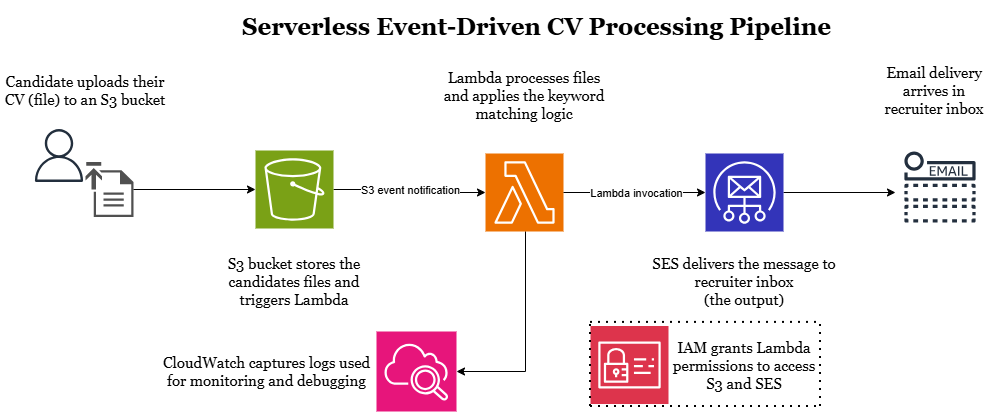

# Serverless CV Processing Pipeline | AWS

A serverless, event-driven pipeline built on AWS that automatically screens candidate CVs and notifies recruiters by email. Built as a hands-on project to apply core AWS services.

---

## Architecture



---

## How It Works

1. A candidate uploads their CV (file) to an **S3 bucket**
2. The upload triggers an **S3 event notification** that invokes a **Lambda function**
3. Lambda runs keyword matching logic against the CV content
4. Based on the result, Lambda calls **SES (Simple Email Service)** to send a notification to the recruiter inbox
5. **CloudWatch** captures all Lambda logs for monitoring and debugging
6. **IAM roles** grant Lambda the minimum required permissions to access S3 and SES

---

## AWS Services Used

| Service | Role in this project |
|---|---|
| S3 | Stores uploaded CVs and triggers Lambda on new uploads |
| Lambda | Runs the keyword matching logic (Python) |
| SES | Sends the screening result email to the recruiter |
| CloudWatch | Logs Lambda executions for monitoring and debugging |
| IAM | Controls permissions between services |

---

## Lambda Function

The core logic runs in Python. It extracts text from the uploaded CV, checks for a predefined list of keywords, and routes the result to SES.

```python
import boto3
import json
import urllib.parse

s3_client = boto3.client('s3')
ses_client = boto3.client('ses', region_name='us-east-1')

SENDER_EMAIL = 'georgesatef750@gmail.com'
RECIPIENT_EMAIL = 'georgesatef750@gmail.com'

KEYWORDS = ['aws', 'networking', 'python', 'linux', 'cloud', 'cisco', 'ccna']

def lambda_handler(event, context):
    
    bucket_name = event['Records'][0]['s3']['bucket']['name']
    object_key = urllib.parse.unquote_plus(event['Records'][0]['s3']['object']['key'])
    
    print(f"New file uploaded: {object_key} in bucket: {bucket_name}")
    
    response = s3_client.get_object(Bucket=bucket_name, Key=object_key)
    file_content = response['Body'].read().decode('utf-8', errors='ignore').lower()
    
    found_keywords = [kw for kw in KEYWORDS if kw in file_content]
    
    if found_keywords:
        subject = f"Strong candidate: {object_key}"
        body = (
            f"Resume received: {object_key}\n\n"
            f"Keywords detected: {', '.join(found_keywords)}\n\n"
            f"Recommendation: Review this candidate."
        )
    else:
        subject = f"Resume received: {object_key}"
        body = (
            f"Resume received: {object_key}\n\n"
            f"No matching keywords found.\n\n"
            f"Recommendation: Standard review queue."
        )
    
    ses_client.send_email(
        Source=SENDER_EMAIL,
        Destination={'ToAddresses': [RECIPIENT_EMAIL]},
        Message={
            'Subject': {'Data': subject},
            'Body': {'Text': {'Data': body}}
        }
    )
    
    print(f"Email sent. Keywords found: {found_keywords}")
    
    return {
        'statusCode': 200,
        'body': json.dumps('Pipeline executed successfully')
    }
```

---

## Demo

For a full walkthrough with explanation, see the LinkedIn post, 11-minute explained video:

https://www.linkedin.com/posts/george-morcos-bb340b26b_aws-serverless-lambda-ugcPost-7458140318257840128-VvnO?utm_source=share&utm_medium=member_desktop&rcm=ACoAAEIXMPcB3vQZlWay7Zn3vqPHi9H-lx_gk-U

---

## Screenshots

Step-by-step screenshots are available in the [`/screenshots`](./screenshots) folder, covering:
- S3 bucket setup and uploaded CVs
- Lambda function configuration and trigger
- CloudWatch logs after processing strong and weak candidate CVs
- Lambda test results

---

## What I Learned

This project pushed me to understand how AWS services communicate with each other, not just what each service does in isolation. Configuring IAM permissions correctly took more iteration than expected and gave me a real appreciation for least-privilege access. Seeing CloudWatch logs reflect exactly what my Lambda code was doing made the event-driven model click in a way that reading about it did not.

---

[LinkedIn](https://linkedin.com/in/george-morcos-bb340b26b) | [GitHub](https://github.com/ge0rgehabib)
